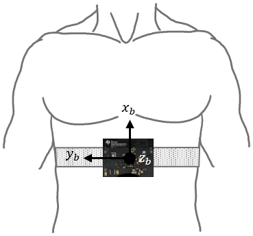

# UBC Mentorship
## Overview
Python program that interfaces with the TI CC2650 SensorTag microcontroller, specifically its inertial measurement unit (IMU) which contains 3 sensors (gyroscope, accelerometer, and magnetometer). The Bluetooth Low Energy (BLE) wireless personal area network protocol is used to communicate data (with the help of [the Python bluepy library](http://ianharvey.github.io/bluepy-doc/ "Bluepy Documentation")) to a Raspberry Pi 3 computer. The data is then used to for a real-time 3D simulation of the SensorTag's rotation, which is strapped to the subject's abdomen to monitor sleeping body position.

Since data is sent as bytes from the sensor, we converted them into hexadecimal numbers, then to integers, then did the necessary calculations to find the gravitational acceleration (in Gs) on each axis, and then found the angles of rotation from that.

Created as a part of the Sensory Information Technologies for Sleep Monitoring Research Project at the Advanced Materials and Process Engineering Laboratory.

*Thank You To:*  
Professor John Madden (Electrical and Computer Engineering at UBC)  
Ezequiel Hernandez (Graduate Research Assistant at UBC)  
Professor Edmond Cretu (Electrical and Computer Engineering at UBC)  
