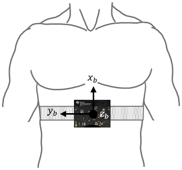
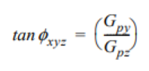
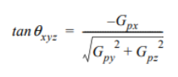

# UBC Mentorship Research Project
## Overview
Python program that interfaces with the TI CC2650 SensorTag microcontroller, specifically its inertial measurement unit (IMU). The IMU contains 3 sensors: a gyroscope, accelerometer, and magnetometer. The Bluetooth Low Energy (BLE) wireless personal area network protocol is used to communicate data (with the help of [the Python bluepy library](http://ianharvey.github.io/bluepy-doc/ "Bluepy Documentation")) to a Raspberry Pi 3 computer. The data is then used for a real-time 3D simulation of the SensorTag's rotation which corresponds to body position since the SensorTag is strapped to the sleeping subject's chest.

## Calculations
Data sent from the SensorTag in hexadecimal format is converted to integers which are used to calculate gravitational acceleration (in Gs) on each axis.

To find the angle of rotation on the X axis, the arc tangent 2 of the gravitational acceleration on the Y axis is divided by the gravitational acceleration on the Z axis. Since there would be issues if the gravitational acceleration on the Z axis was 0, a negligible number is added every time Z reaches 0 Gs.  
  
To find the angle of rotation on the Y axis where Gp is the gravitational acceleration on any given axis:
  
Finally, the 3D simulation is created by plotting the vertices, connecting them, and creating surfaces between them using [the PyOpenGL library](http://pyopengl.sourceforge.net/ "PyOpenGL library"). The rotation matrix is then translated by the angles given by our previous calculations (on the X and Y axes).

### Created as a part of the Sensory Information Technologies for Sleep Monitoring Research Project at the Advanced Materials and Process Engineering Laboratory.

The project is run by a group of students and professors at UBC developing different sensors that work together to detect sleep disorders. The goal is to develop a low cost sleep disorder diagnosis system that can be used at home. The user would wear all of the sensors (EEG, EKG, EMG, etc) which would work in a body sensor network. The network includes a central device (computer or smartphone) that processes the data and determines whether the user has a sleep disorder, and if so which one.

*Thank You To:*  
Professor John Madden (Electrical and Computer Engineering at UBC)  
Ezequiel Hernandez (Graduate Research Assistant at UBC)  
Professor Edmond Cretu (Electrical and Computer Engineering at UBC)  
